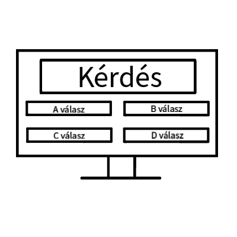

### Áttekintés

Vágó István szeretne Legyen ön is milliomos játékot online játszani a Covid miatt, mert nem tudnak bemenni a stúdióba. Javascript nyelven szeretné lefejleszteni egy webes felületet, ahol az emberek tudnak játszani. A játékosoknak lehetőségük lesz kérdésekre választ adni egy előre megadott felsorolásból. Ha helyesen válaszolnak, akkor nyereményük növekszik, és egy következő kérdésre léphetnek. A játékos megállhat a játék bármelyik pontján, és akkor a jelenlegi nyereményt elviheti. A játékban 5 kérdésenként fix nyeremény van, amelyet a játékos akkor vihet el, ha rosszul válaszol, vagy ha épp ott áll meg és rendelkezik az adott fix nyereménnyel. A játékosnak lehetősége van a játék során segítségeket igényelnie (telefonos, nézői, kérdés felezés), de ezeket egy játék során összesen egyszer használhatja fel.

### Jelenlegi helyzet

### Követelménylista

- Egy adatbázis, amiből konzisztensen lehet írni és olvasni
- Egy grafikus felület, ami interakciót hajthat végre a felhasználóval
- Angol és magyar nyelv

### Jelenlegi üzleti folyamatok modellje

A nézők a tévében látott Legyen Ön is Milliomos műsor után szívesen játszanának maguk is egy ilyen játékon. Mivel a műsorba a bejutás ritka, ezért szeretnénk elkészíteni egy mindenki számára elérhető Legyen Ön is Milliomos játékot, melyet bármely böngésző segítségével könnyen el tud érni a játékos.

### Igényelt üzleti folyamatok modellje

### Használati esetek

### Képernyő tervek

Számítógépes megjelenés:

Mobilos megjelenés:

### Forgatókönyv

- Felhasználók nyomon követése
- Kérdések kiolvasása az adatbázisből
- Néző interakciói a grafikus felülettel
- MVC (modell view controller) model megvalósítása
- Váltás a kérdések között
- Játék szakaszainak implementálása

### Funkció - követelmény megfeleltetés

### Fogalomszótár

- [MVC modell:](https://hu.wikipedia.org/wiki/Modell-n%C3%A9zet-vez%C3%A9rl%C5%91)  Összetett, sok adatot a felhasználó elé táró számítógépes alkalmazásokban gyakori fejlesztői kívánalom az adathoz (modell) és a felhasználói felülethez (nézet) tartozó dolgok szétválasztása, hogy a felhasználói felület ne befolyásolja az adatkezelést, és az adatok átszervezhetők legyenek a felhasználói felület változtatása nélkül. A modell-nézet-vezérlő ezt úgy éri el, hogy elkülöníti az adatok elérését és az üzleti logikát az adatok megjelenítésétől és a felhasználói interakciótól egy közbülső összetevő, a vezérlő bevezetésével.