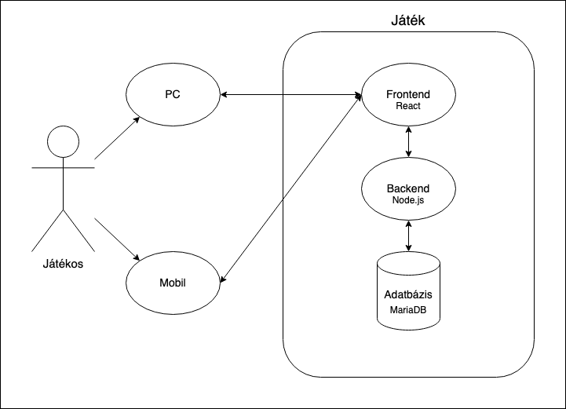

# Rendszerterv

### 1. Rendszer célja

A rendszer célja, hogy a felhasználó egy játékos kvíz alkalmazásban jutalmakért mérethesse meg a tudását, amely alapjait a Legyen Ön is Milliomos című tévés vetélkedő adja.
A játék szintekből épül fel, melyeken különböző nehézségű kérdésekre kell megfelelő választ adni négy lehetőség közül.
Minden teljesített szint után növekszik a nyerhető díj, és bizonyos szintenként fix nyeremények is vannak, melyeket ha egyszer elért a játékos, akkor is megkap, ha egy későbbi kérdésnél rossz választ jelölne.
A játékban lehetőség van segítségek használatára (telefonos, nézői és felezéses). Fontos, hogy a felhasználó jól átlássa a felületet, ezért minimalista és reszponzív dizájnnal fog elkészülni, hogy a lehető legtöbb kijelző felbontáson jól láthatóak legyenek a játék elemei.
A szoftver - mivel böngészőben lehet majd játszani - megnyitható lesz bármely olyan okos eszközön, amely támogatja a legfrissebb számítógépes, illetve telefonos operációs rendszereket (pl. Windows 10 és frissebb,  Android 8.0 vagy iOS 10 és frissebbek) és böngészőket (pl.  Google Chrome v100 és frissebb).

### 2. Projekt terv

Projekt lebonyolítása:

- A projekt kódolására egy hetet fogunk fordítani.
- Az adatbázis megtervezése és kivitelezése, adatok feltöltése az adatbázisba Tomi  feladata lesz.
- A frontend kódot Viktor és Kristóf írja.
- A backend kódot Viktor, Kristóf és Tomi írja.
- A teszteket a frontendhez Viktor és Kristóf írja.
- A teszteket a backendhez Tomi írja.

### 3. Üzleti folyamatok modellje

### 4. Követelmények

#### 4.1. Webes felület (responsive webdesign)

  - frameworks
    - REACT + HTML - javascript frontend
    - NODEJS - javascript backend
    - MariaDB - adatbázis,- SQL a játékhoz
  - felhasználói
  - opcionális admin vagy kvízmester felület
    - esetleges toplista
  - biztonság
    - adatkezelés és GDPR kérdések
    - a szerver védve legyen a támadásoktól 
    - a játékos ne tudjon csalni
      - ne tudja megszegni a játékszabályokat
      - ne tudja manipulálni az adatbázist és a kérdéseket
    - a rendszer naplozásában / adatbázisában kell tudni, hogy:
      - a játékos nem jelölt meg semmit, mert mondjuk elment a nete.

#### 4.2. Adatbázis (ingyenes, de mindent tudjon, szokásos hozzáállás)

  - Zéró redundancia és felesleges függőség
  - kérdések tárolása
    - válaszlehetőségek, helyes válasz
    - nehézségi szint, nyeremény, fix nyeremény-e?
    - hány ember adott rá jó / rossz választ
    - magyar vagy angol nyelven
  - a felhasználó adatainak tárolása
    - név
    - email
    - nem (lehet null érték, ha nem ismert vagy nem szeretné megadni)
    - regisztráció ideje
    - elvitt nyeremény
    - játszott játékok, kérdésekre adott válaszok
  - a játékok tárolása
    - ki -és mikor játszotta
    - hanyadik szintig jutott el
    - fix nyereménnyel kiszállt vagy bevállalós volt
    - mik voltak a kérdések, milyen válaszokat adott rá 

#### 4.3. Segítségek használata

  - három segítség megengedett
    - kérdésenként egy, játékonként egy fajtából egy

### 5. Funkcionális terv

#### 5.1. A felhasználónak:

  - be kell tudni jelentkeznie
  - játékot kell tudni indítania
    - tudjon nyelvet váltani (játék előtt)
    - ki tudjon belőle szállni
    - kérdést tudjon megjelölni, visszajelzést kell kapnia

#### 5.2. A szervernek:

  - react + html, css frontend, nodejs backend, MariaDB adatbázis
  - az egyes komponenseknek jól kell kommunikálnia egymással
  - a játék, játékos, rendszer minden folyamatát naplózni kell
  - folyamatosan futni kell, nem szabad random leállnia

### 6. Fizikai környezet

#### 6.1. Felhasználói környezet:
Az alkalmazás webes platforma készül. 
Használatához szükséges a böngészők legfrissebb verziójának megléte.
A webes felületnek köszönhetően használható lesz telefonos, illetve számítógépes környezetben is.

#### 6.2. Fejlesztői környezet:

Kódolás:
- VSCode (Microsoft)
- Webstorm IDE (JetBrains)
- NetBeans (Apache)

Fájlok megosztása:
- Google Drive

Ábrák szerkesztése:
- Paint
- Draw.io

Kommunikációs csatornák:
- Facebook Messenger
- Discord
- Trello

### 7. Absztrakt domain modell

### 8. Architekturális terv

Mobilra és számítógépre tervezzük kiadni a szoftvert.
A játékost vizuálisan ki kell szolgálni attól függően, hogy a kijelzője függőleges vagy vízszintes tájolású.
A játékban személyre kell tudni szabnia a játékosnak, hogy milyen nyelvű kérdéseket kapjon.

### 9. Adatbázis terv

Az adatbázis esetében kiemelten fontosnak tartjuk, hogy zéró redundancia legyen az adatok között, növelve a megbízhatóságot és a hitelességet. Ezért egy játék táblában nem tárolhatom azt, hogy meddig jutott el az illető, mert a játékban végbemenő szintek lebonyolitása egy másik tábla feladata, az pedig, hogy mennyit nyert, szintén nem tárolhatom, mert redundanciát okozna, ami viszont az adott nehézségi szint kérdéséhez tartozik. 

Máshogy megfogalmazva arra vagyunk kíváncsiak, hogy adott játékos mennyi pénzt vitt haza az utolsó játékában. Ha a játékban tárolnám a nyereményt, akkor hibás lenne az adatbázis, mert ez az érték származtatható. Nézzük is meg.
A játékos táblában rákeresünk az adott játékosra, ezt összekötjük a játék táblával, és dátum alapján szűrűnk az adott játékoshoz tartozó időben legközelebbi játékra. Ha ez megvan, akkor összekötjük a játékot a játékbeli kérdések táblával, és játék id alapján rákeresünk, hogy milyen kérdések hangzottak el. Itt tovább megyünk a kérdések táblára, ahol szerepel egy kérdés nehézségi szintje és az, hogy a válaszunk jó-e. Így meg tudjuk nézni egy feltételben, hogy jó választ adunk-e a legmagasabb szintű kérdésében és logikai vagy-gyal összekötve mondjuk azt, hogy a válasz a legnehezebb kérdésre helytelen, ezt összekötve logikai és-el a legmagasabb fix nyeremény, amit a kérdés jutalom táblából tudhatunk meg.

Elsőre kicsit zavarosnak hangzik, de minden felesleges függőség és redundancia meg van szűntetve. Ez összességében bonyolultabbá teszi a lekérdezéseket, de sokkal biztonságosabbá, sokaldalúbbá, kevesebb adatot is igényel.

Ezzel az adatbázissal képesek leszünk egy teljes játékot naplózva eltárolni, egészen attól, hogy milyen sorrendben jöttek a kérdések, milyen választ adott rá az illető, mikor,- és ki játszott, mennyi pénzt nyert stb. anélkül, hogy erről hosszú naplóüzeneteket vezetnénk, és tárolnánk egy külön adatbázisban, mindent lehet kérdezni. További igények nem merültek fel. 

És igen, gondoltunk arra, mi van, ha a játékos internete vagy bármi megszakad játék közben. Ugye kérdés közben nem lehet kiszálni, valamit válaszolni kell. Erre is van megoldás. A választott kérdés az adott kérdésnél lehet NULL érték. Ezzel jelezve azt, hogy a játékos nem tudott a kérdésre válaszolni, és ezt a lekérdezésekben is tudjuk implementálni, így nem fogunk kapni hamis nyereményösszegeket.

Számunkra nagyon fontos a jó skálázhatóság, az ingyenesség, megbízhatóság, esetleges titkosítás, integráció, nyílt forráskódú, projectfüggetlen adatbázis-szerver, ami SQL lekérdezéseket használ egy relációs adatbázisban. Több adatbáziskezelőt is megnéztünk, és a MariaDB-re esett a választás. Az alábbi érvelésben nem cél szidni az Oracle-t, akinek van pénze,- ideje,- kedve rá, és az Amerikai Nemzeti Bank szintű rendszert szeretne építeni, az nem nyúlhat mellé vele, de nekünk az előbbiek fontosak. Az okok a következők voltak:
 - Oracle erősen fizetős, az ingyenes verzióban:
   - Egy szálon enged adatbázisműveleteket futtatni (0 skálázhatóság)
   - Táblák szába, adatbázisméret nagyon kicsi (max 11 GB)
   - Nincs titkosítás és ehhez szükséges feature-ök
   - Haladó adatbázisműveletek sincsenek benne
 - MsSQL syntax és integráció is teljesen más
   - Inkább Windows-ra van tervezve, nem Linuxra
   - Bár engedékenyebb, mint az Oracle, szintén fizetős
 - NoSQL és egyébb nyelvek opció lett volna, de
   - szerettjük a relációs adatbázist és az SQL-t. 
 - MySQL lett volna egy jó választás, de
   - Megvette az Oracle, és kevésbé fejlesztik
   - A C.E. ingyenes, nyílt forráskódú, engedékeny
   - Felváltotta a fork-ja, a MariaDB

Szóval ezek miatt döntöttünk a MariaDB mellett, ez szinte mindent tud, amit egy Oracle, ha nem valami nagyon durva banki rendszert akarok felhúzni (bár titkosítást támogat), a syntax is hasonló.
Ha nem lett volna ez, akkor valószínüleg MySQL-t választottunk volna, bár erősen ügyelnek arra, hogy a kettő egymással kompatibilis legyen.

### 10. Implementációs terv

### 11. Teszt terv

#### 11.1. Különböző böngészők tesztelése:

- *@veresviktor02* - Safari (WebKit)
- *@egyiptomi425* - Brave (Blink)
- *@pkristof1999* - Firefox (Gecko)

#### 11.2. Különböző operációs rendszerek tesztelése:

- *@veresviktor02* - MacOS Ventura (13)
- *@egyiptomi425* - Ubuntu Linux 23.04
- *@pkristof1999* - Windows 11

Teszteléseknél törekszünk arra, hogy minél több rendszeren, 
és minél több fajta böngészővel próbáljuk ki a kész szoftvert, 
hogy a lehető legnagyobb tesztlefedettséggel tudjuk biztosítani a hibátlan szoftver működést.

#### 11.1. Béta teszt:

A teszt célja a szoftver funkcióinak átfogó ellenőrzése különböző operációs rendszerek használatával és minél több fajta böngészővel.
Teszteléskor ellenőrzésre kerül továbbá, hogy a szoftver minden főbb felbontáson hibátlanul, 
jó láthatósággal működik-e (pl. 1280×720p [minimum támogatott felbontás], 1366×768p, 1920×1080p, 2560×1440p és 3840×2160p [maximum támogatott felbontás]).
A teszt tervezett időtartama egy hét.

#### 11.2. Release teszt:

A szoftver bemutatásra kerül.
A tesztelés alatt visszajelzéseket fogadnak a fejlesztők.
Hiba, vagy változtatási kérelem esetén a fejlesztők a lehető leghamarabb javítják, módosítják a programot.
A teszt időtartama a bemutatás órája.

### 12. Telepítési terv

 - A szoftver webes felületéhez egy ajánlott böngésző telepítése szükséges (Google Chrome, Firefox, Opera, Safari), illetve egy olyan operációs rendszer használata, mely ezen böngészők legfrissebb verziójának futtatására képes. Ezen kívül egyéb szoftver nem szükséges a futtatáshoz.
 - A webszerverre közvetlenül az internetről kapcsolódnak rá a kliensek.

### 13. Karbantartási terv

 - Új kérdések hozzáadása, hibás/elavult kérdések javítása.
 - Jövőben felmerülő biztonsági hibák javítása.
