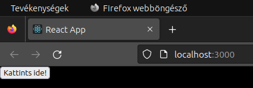
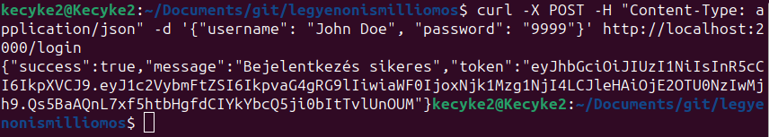
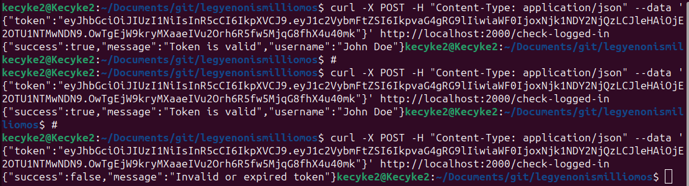

Létrehoztam a weboldalt, elindítottam, és pár egyszerű dolgot implementáltam. A hátteret feketére cseréltem, mert kiégett a retinám a fehértől.

A token alapú hitelesítés sikeres volt (bejelentkezéskor).
Adatbázis lekérdezés volt használva.

Később a HEXA aláíró kulcsot ASCII karaktersorozatra cseréltem, hogy gyorsabb, rövidebb, és biztonságosabb legyen.

Ezután neki láthattam a már bejelentkezett felhasználók ellenőrzésének tokennel.
A token aláíró kulcs minden szerverindításkor újra generálódik, 16 asci karakterből álló jelszó (nem feltörhető), és curlben már sikeresen tudtam autentikálni meglévő tokennel post kérést küldve.

