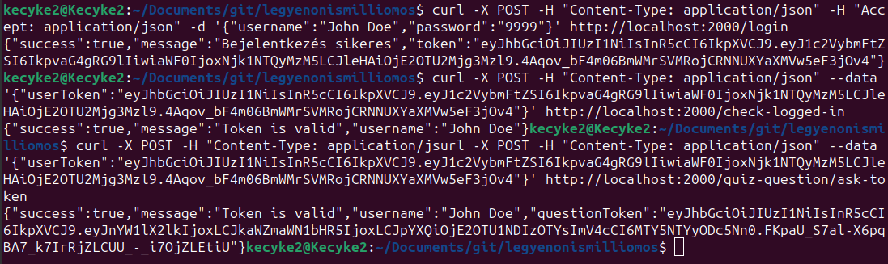

Létrehoztam a weboldalt, elindítottam, és pár egyszerű dolgot implementáltam. A hátteret feketére cseréltem, mert kiégett a retinám a fehértől.

A token alapú hitelesítés sikeres volt (bejelentkezéskor).
Adatbázis lekérdezés volt használva.

Később a HEXA aláíró kulcsot ASCII karaktersorozatra cseréltem, hogy gyorsabb, rövidebb, és biztonságosabb legyen.

Ezután neki láthattam a már bejelentkezett felhasználók ellenőrzésének tokennel.
A token aláíró kulcs minden szerverindításkor újra generálódik, 16 asci karakterből álló jelszó (nem feltörhető), és curlben már sikeresen tudtam autentikálni meglévő tokennel post kérést küldve.
Látható, ha újraindítom a szervert vagy a token lejárt, akkor false választ küld nekem.

Később sikerült authentikációs tokent kérni bejelentkezés és sikeres hitelesítés után arra, hogy játékot indítsunk, és egy kérdés-tokent kapjunk. A token lényege, hogy visszafejtéskor tartalmazza a game_id és a difficulty paramétereket. Mivel új játék, ezért új game_id és level 1 difficulty szintet kap. Minden token egyedi, a game_id-ből pedig adatbázisból lehet következtetni a játékosra, akinek regisztrálja az új játékát. A csalás elkerülése végett lesz.

